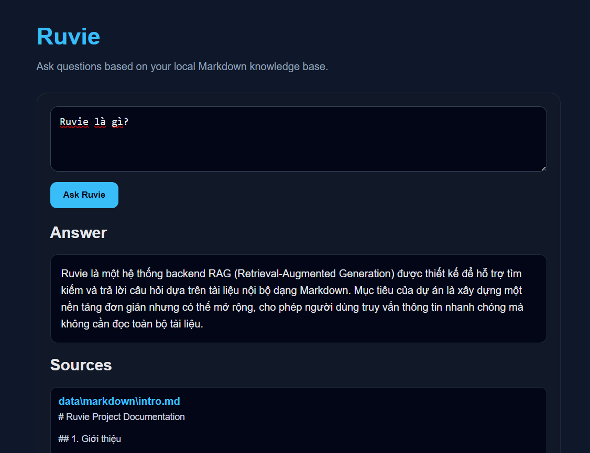

# Ruvie Agent


<p align="center">
  <strong>Minimal local RAG app for Markdown knowledge bases, built with FastAPI, Chroma, FastEmbed, and an OpenRouter-compatible LLM client.</strong>
</p>

## Choose Language

- [English](README.en.md)
- [Tiếng Việt](README.vi.md)
- [Русский](README.ru.md)

## App Preview



## Overview

Ruvie Agent is a lightweight local RAG app for Markdown documents with a simple web UI and JSON API.

## Quick Start

```bash
python -m venv .venv
.venv\Scripts\activate
pip install -r requirements.txt
copy .env-example .env
uvicorn app.main:app --reload
```

Open `http://localhost:8000`.

## Current Features

- Web UI at `/`
- `POST /ask` for answers with sources
- `POST /ingest` to rebuild the vector database
- Markdown ingestion with Chroma-based retrieval
